<!--more-->

## 规划区

```mermaid
gantt
dateFormat HH:mm
axisFormat %H:%M
tickInterval 1h
title 今天大概要做

section 博客相关内容
梳理规划一天的方法、完成日记模板的创建:done,riji,06:00, 2h
完成博客的自动发布系统:fabu, after riji, 1h
总结文档《使用huog+github pages搭建博客流程》:after fabu, 90m

section 习惯
算法每日一题: 1h
```

gantt：

gantt
dateFormat HH:mm
axisFormat %H:%M
tickInterval 1h
title 今天大概要做

section 博客相关内容
梳理规划一天的方法、完成日记模板的创建:done,riji,06:00, 2h
完成博客的自动发布系统:fabu, after riji, 1h
总结文档《使用huog+github pages搭建博客流程》:after fabu, 90m

section 习惯
算法每日一题: 1h


## 记录区-习惯记录

打卡状态： ✅   |  ❌

|日期|算法|阅读|
|-|-|-|
|1|||
|2|||
|3|||
|4|||
|5|||
|6|||
|7|||
|8|||
|9|||
|10|||
|11|||
|12|||
|13|||
|14|||
|15|||
|16|||
|17|||
|18|||
|19|||
|20|||
|21|||
|22|||
|23|||
|24|||
|25|||
|26|||
|27|||
|28|||
|29|||
|30|||
|31|||


## 记录区-事&物记

- 重要事记

无

- 新事物

## 记录区-随手记
（挑首歌？local:[202305101553 博客音乐嵌入样例](content/posts/life/music/202305101553%20博客音乐嵌入样例.md) remote:[202305101553 博客音乐嵌入样例](http://honghuiqiang.com/202305101553-%E5%8D%9A%E5%AE%A2%E9%9F%B3%E4%B9%90%E5%B5%8C%E5%85%A5%E6%A0%B7%E4%BE%8B/)）

## 记录区-总结

心情打分：
- [ ] 😆 很快乐
- [ ] 🙂 一般快乐
- [ ] 😶 无明显情绪波动
- [ ] 🧐有疑问
- [ ] 😵‍💫 很混乱
- [ ] 😮‍💨叹气
- [ ] 😡 生气

输出内容：

## 记录区-明天

